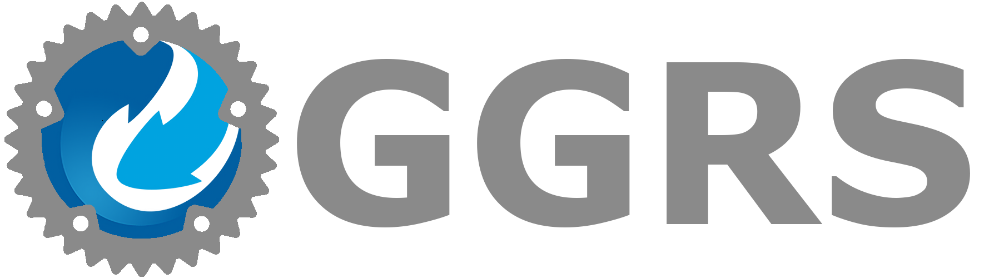

# 

## P2P Rollback Networking in Rust

GGRS (good game rollback system) is a reimagination of the [GGPO network SDK](https://www.ggpo.net/) written in 100% safe [Rust 🦀](https://www.rust-lang.org/). The callback-style API from the original library has been replaced with a much saner, simpler control flow. Instead of registering callback functions, GGRS returns a list of requests for the user to fulfill.

If you are interested in integrating rollback networking into your game or just want to chat with other rollback developers (not limited to Rust), check out the [GGPO Developers Discord](https://discord.com/invite/8FKKhCRCCE)!

## Live Demonstrations

GGRS has a demo app you can try in the browser! It uses [macroquad](https://github.com/not-fl3/macroquad) and [matchbox](https://github.com/johanhelsing/matchbox). Try it out with a friend! Just click the link and match with another player! (You can also open the link in two separate windows to play against yourself)

- [Demo](https://gschup.github.io/ggrs_demo/)
- [Demo Repository](https://github.com/gschup/ggrs_demo)

## Getting Started

To get started with GGRS, check out the following resources:

- [Wiki](https://github.com/gschup/ggrs/wiki)
- [Examples](./examples/)
- [Documentation](https://docs.rs/ggrs/newest/ggrs/)

## Development Status

GGRS is in an early stage, but the main functionality for multiple players and spectators should be quite stable. See the Changelog for the latest changes, even those yet unreleased on crates.io! If you want to contribute, check out existing issues, as well as the contribution guide!

- [Changelog](./CHANGELOG.md)
- [Issues](https://github.com/gschup/ggrs/issues)
- [Contribution Guide](./CONTRIBUTING.md)

## Useful Links

### Bevy Plugin

The authors of GGRS are also maintaining a [Bevy](https://bevyengine.org/) plugin. Check it out:

- 👉[Bevy GGRS](https://github.com/gschup/bevy_ggrs)

### WASM support through WebRTC sockets

If you are interested to run a GGRS application in your browser, check the amazing Matchbox project! The repository includes a full running demo you can try right now.
The matchbox sockets are compatible with GGRS through a feature flag:

- 👉[Matchbox](https://github.com/johanhelsing/matchbox)

### Godot Wrapper

marcello505 is currently developing a wrapper for [Godot](https://godotengine.org/). Find the repository here:

- 👉[Godot GGRS Wrapper](https://github.com/marcello505/godot-ggrs-wrapper)

### Other Rollback Implementations in Rust

Also take a look at the awesome backroll project, a completely async rollback library. Special thanks to james7132 for a lot of inspiration and fruitful discussion.

- 👉[backroll-rs](https://github.com/HouraiTeahouse/backroll-rs/)

## Licensing

GGRS is dual-licensed under either

- [MIT License](./LICENSE-MIT): Also available [online](http://opensource.org/licenses/MIT)
- [Apache License, Version 2.0](./LICENSE-APACHE): Also available [online](http://www.apache.org/licenses/LICENSE-2.0)

at your option.
